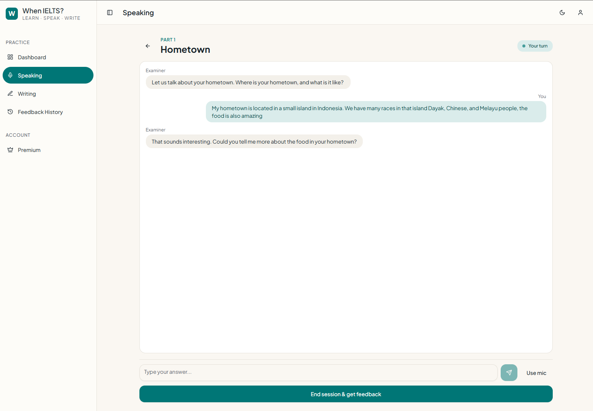
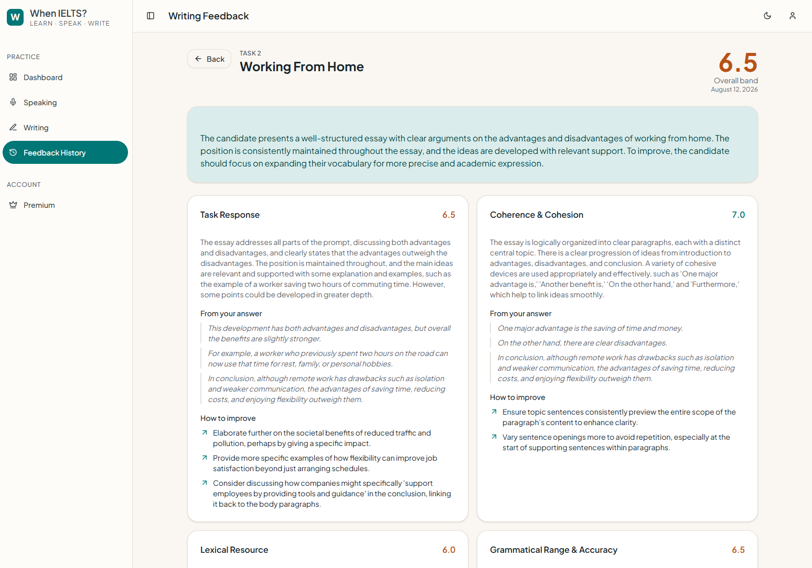
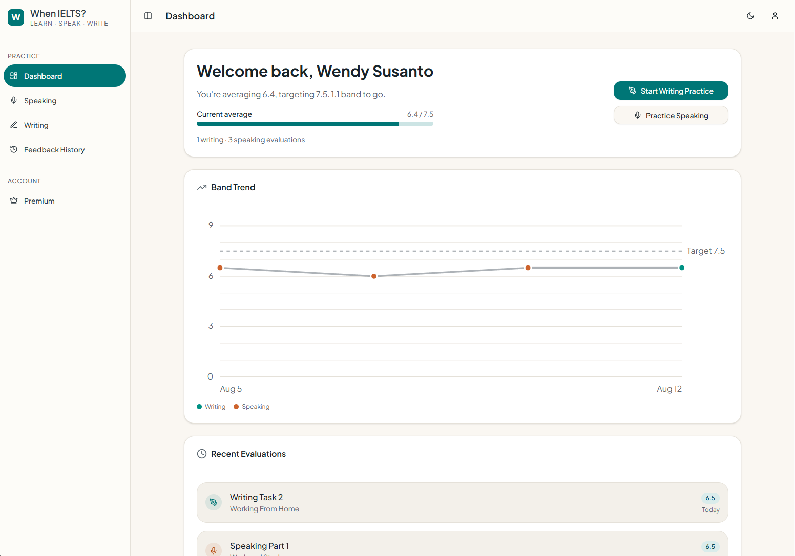

# When IELTS?

Scores IELTS writing and speaking practice against the official band descriptors and returns criterion-by-criterion feedback, built for self-studying test candidates who need to know where they actually stand.

[LIVE DEMO](https://orange-desert-0c2792e00.3.azurestaticapps.net/)

---

## Screenshots


_Speaking practice mid-session: the examiner's opening question, the candidate's transcribed answer, and the follow-up the model generated from what was actually said. Answers can be spoken via **Use mic** or typed — the typed path is a full fallback when Azure Speech isn't configured._


_Writing feedback detail: overall band, the four criterion scores (Task Response, Coherence and Cohesion, Lexical Resource, Grammatical Range and Accuracy), and the per-criterion notes._


_Dashboard: band trend over time and recent writing and speaking attempts._

---

## How it works

A candidate picks a prompt and either writes an essay or holds a spoken conversation with an AI examiner. For speaking, the browser streams audio to Azure Speech, which returns both the transcript and an acoustic pronunciation assessment, while the backend calls Gemini between turns to generate the examiner's next follow-up question. On submission, the .NET backend builds the model input server-side — prompt text, cue points, the full transcript, and the measured fluency score — and calls Gemini with `responseMimeType: application/json` plus an explicit `responseSchema`, so feedback comes back as typed JSON rather than prose that needs parsing. The service then recomputes the overall band itself as the mean of the criterion scores rounded to the nearest 0.5, ignoring whatever overall figure the model returned. The result is persisted with its token counts and rendered as a scorecard the candidate can revisit from history.

Source: [`WritingService.cs`](backend/IELTS.AI.Evaluator.Functions/Services/WritingService.cs), [`SpeakingService.cs`](backend/IELTS.AI.Evaluator.Functions/Services/SpeakingService.cs), [`GeminiStructuredClient.cs`](backend/IELTS.AI.Evaluator.Functions/Services/GeminiStructuredClient.cs)

---

## Tech stack

**Frontend** (`frontend/ielts-ai-evaluator-frontend`)

- React 19.1 / TypeScript 5.8 / Vite 7.0
- Tailwind CSS 4.1, Radix UI primitives, Lucide icons
- React Router 7.6, React Hook Form 7.61, Axios 1.11
- Firebase JS SDK 12.1 (auth)
- microsoft-cognitiveservices-speech-sdk 1.50 (STT, TTS, pronunciation assessment)
- Node 22.x

**Backend** (`backend/`)

- .NET 8 Azure Functions, isolated worker (Worker + Http.AspNetCore 2.0.0)
- PostgreSQL via Npgsql 9.0.4 / EF Core 9.0.7 with migrations
- FirebaseAdmin 3.3.0 (server-side token verification)
- Google Gemini API (structured JSON output)
- xUnit 2.9.3 — 13 test classes, run as a deploy gate

**Hosting** — Azure Static Web Apps (frontend), Azure Functions (API), both deployed from GitHub Actions on push to `main`.

---

## Engineering decisions

**No AI provider key ever reaches the browser.** The Gemini key is read server-side from configuration in [`GeminiStructuredClient.cs:34`](backend/IELTS.AI.Evaluator.Functions/Services/GeminiStructuredClient.cs#L34) and sent as an `x-goog-api-key` header from the Function App; the frontend only ever talks to our own API. Azure Speech needs to run in the browser to capture audio, so it gets the same treatment one level down — [`SpeechTokenService.cs`](backend/IELTS.AI.Evaluator.Functions/Services/SpeechTokenService.cs) exchanges the subscription key for a 10-minute STS token and hands the client only that. The client holds a short-lived, scoped credential instead of a permanent one.

**Scores are recomputed server-side, never accepted from the client.** The pronunciation band is derived from Azure's raw score in [`SpeakingService.cs:77`](backend/IELTS.AI.Evaluator.Functions/Services/SpeakingService.cs#L77) rather than read off the request, and the overall band is averaged from the criteria in [`SpeakingService.cs:87-91`](backend/IELTS.AI.Evaluator.Functions/Services/SpeakingService.cs#L87-L91) rather than taken from Gemini's own `overallBand` field. A tampered request cannot inflate a band, and the model cannot contradict its own criterion scores.

**Rate limiting is shaped by what each endpoint costs, not by one global number.** [`RateLimitMiddleware.cs:19-29`](backend/IELTS.AI.Evaluator.Functions/Middleware/RateLimitMiddleware.cs#L19-L29) sets 60/hour on the examiner-turn endpoint (one paid Gemini call per turn, ~20 per real session), 30/hour on Speech token issuance (a leaked token is spendable against the Speech resource outside the app), and 300/hour everywhere else. The counter is per-instance in `IMemoryCache`, which is a deliberate accuracy-for-simplicity trade: it stops a scripted loop without adding Redis to the deployment, and the code says so in a comment. Daily per-user evaluation quotas sit on top, enforced against the database.

**Pronunciation is measured, not inferred.** Gemini only ever receives text, so it scores three criteria; pronunciation comes from Azure's acoustic assessment and is averaged in as a fourth. When no audio was assessed, [`SpeakingService.cs:171-173`](backend/IELTS.AI.Evaluator.Functions/Services/SpeakingService.cs#L171-L173) states that explicitly in the prompt so the model scores fluency knowing the signal is absent, and the pronunciation criterion is dropped rather than guessed.

**No state management library.** Server state runs through a ~100-line [`use-api.ts`](frontend/ielts-ai-evaluator-frontend/src/hooks/use-api.ts) hook (`data`/`isLoading`/`error` + `refetch`/`mutate`); the only global state is auth and theme, each a React Context. There is no Redux, Zustand, or React Query in `src/`. Errors are mapped to plain-language strings in [`friendly-error.ts`](frontend/ielts-ai-evaluator-frontend/src/lib/friendly-error.ts) — no HTTP codes shown to users, who are mostly ESL — including a specific message for 429.

**Azure was the objective, not the default.** I built this to work through a full end-to-end Azure deployment while preparing for AZ-204, so the platform choice came first and the architecture followed. That was the point of the exercise, and it put real surface area under my hands: Static Web Apps hosting the SPA, Functions on the isolated worker model behind it, Cognitive Services for speech, app settings and GitHub Secrets as the credential store, and two Actions pipelines that gate on `dotnet test` and run `dotnet ef database update` before publishing. Routing fallback and the security header set — CSP, HSTS, `nosniff`, `frame-ancestors 'none'`, and a `Permissions-Policy` granting `microphone=(self)` while denying camera and geolocation — are declared in [`staticwebapp.config.json`](frontend/ielts-ai-evaluator-frontend/public/staticwebapp.config.json) rather than in a separate CDN or reverse-proxy config. Vercel plus a managed Postgres would have been fewer moving parts; it would also have skipped everything I was trying to learn.

---

## Running locally

Requires Node 22.x, .NET SDK 8.0, Azure Functions Core Tools, and a PostgreSQL instance.

**Frontend**

```bash
cd frontend/ielts-ai-evaluator-frontend
npm install
cp .env.sample .env      # fill in the values
npm run dev              # http://localhost:5173
```

Variables needed in `.env`:
`VITE_FIREBASE_API_KEY`, `VITE_FIREBASE_AUTH_DOMAIN`, `VITE_FIREBASE_PROJECT_ID`, `VITE_FIREBASE_STORAGE_BUCKET`, `VITE_FIREBASE_MESSAGING_SENDER_ID`, `VITE_FIREBASE_APP_ID`, `VITE_FIREBASE_MEASUREMENT_ID`, `VITE_API_BASE_URL`

**Backend**

```bash
dotnet ef database update --project backend/IELTS.AI.Evaluator.Data
cd backend/IELTS.AI.Evaluator.Functions
dotnet build
func start               # http://localhost:7103
```

Settings needed in `local.settings.json` (git-ignored):
`DbConnectionString`, `GeminiApiKey`, `GeminiApiEndpoint`, `GeminiExaminerApiEndpoint`, `GeminiExaminerThinkingBudget`, `FIREBASE_PROJECT_ID`, `FIREBASE_SERVICE_ACCOUNT_JSON`, `AzureSpeechKey`, `AzureSpeechRegion`, `ExaminerVoice`, `DailyWritingQuota`, `DailySpeakingQuota`

Azure Speech is optional — without it, speaking practice falls back to typed input and omits the pronunciation criterion.

**Tests**

```bash
cd backend && dotnet test IELTS.AI.Evaluator.sln
```

The database ships with no seed prompts. Register, then promote yourself with
`UPDATE users SET plan = 'Admin' WHERE email = '...';` to add prompts through the admin panel.
