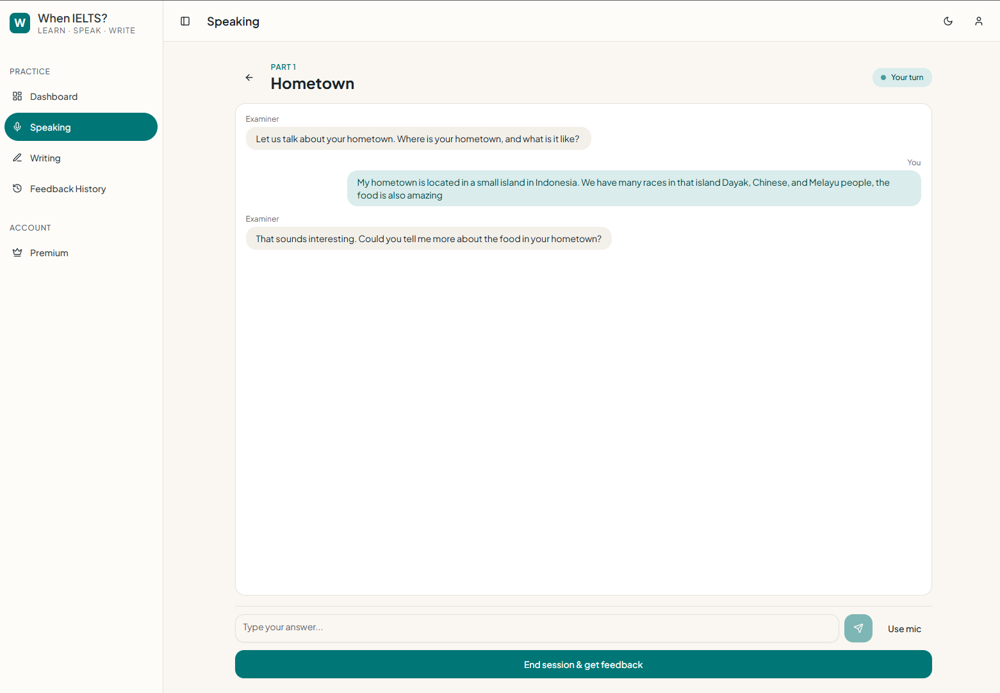
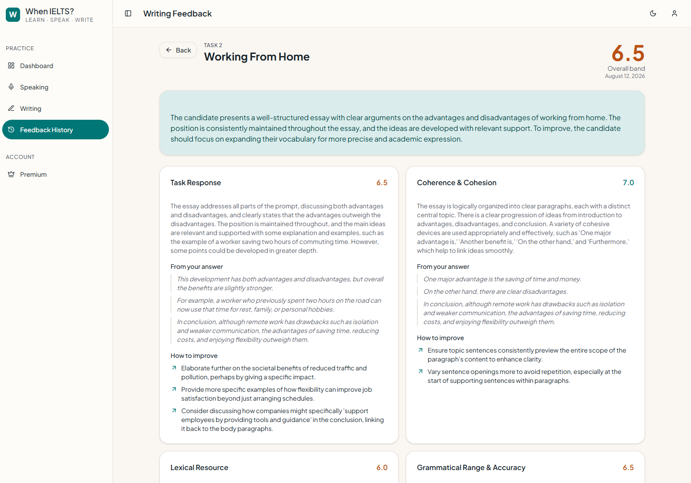
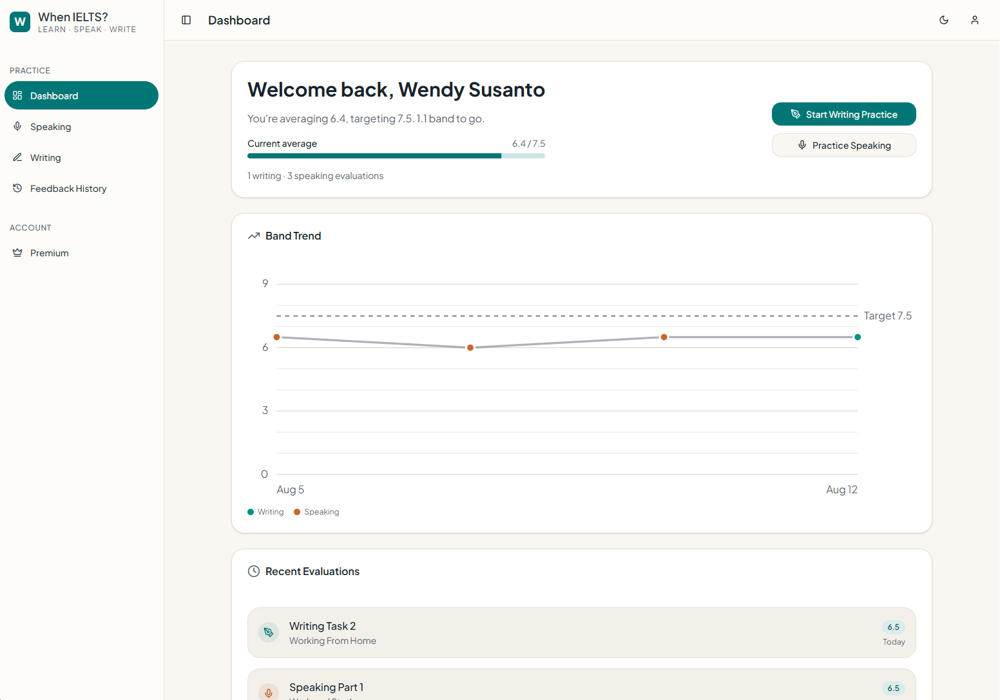

# When IELTS?

Scores IELTS writing and speaking practice against the official band descriptors and returns criterion-by-criterion feedback, built for self-studying test candidates who need to know where they actually stand.

[LIVE DEMO](https://orange-desert-0c2792e00.3.azurestaticapps.net/)

---

## Screenshots


_Speaking practice mid-session: the examiner's opening question, the candidate's transcribed answer, and the follow-up the model generated from what was actually said. Answers can be spoken via **Use mic** or typed — the typed path is a full fallback when Azure Speech isn't configured._


_Writing feedback detail: overall band, the four criterion scores (Task Response, Coherence and Cohesion, Lexical Resource, Grammatical Range and Accuracy), and the per-criterion notes._


_Dashboard: band trend over time and recent writing and speaking attempts._

---

## How it works

A candidate picks a prompt and either writes an essay or holds a spoken conversation with an AI examiner. For speaking, the browser streams audio to Azure Speech, which returns both the transcript and an acoustic pronunciation assessment, while the backend calls Gemini between turns to generate the examiner's next follow-up question. The app opens the microphone itself and hands the same stream to Azure and to a Web Audio level meter, so the candidate sees their voice arriving as live bars beside the mic button, and a hands-free turn ends after three seconds of real silence on the mic rather than three seconds without a recognizer event — those lag after every pause and never come for an "eee…", which cut hesitant speakers off mid-answer ([`use-speech.ts`](frontend/ielts-ai-evaluator-frontend/src/hooks/use-speech.ts), [`VoiceLevelBars.tsx`](frontend/ielts-ai-evaluator-frontend/src/components/VoiceLevelBars.tsx)). On submission, the .NET backend builds the model input server-side — prompt text, cue points, the full transcript, the measured fluency score, and each answer's recording — and calls Gemini with `responseMimeType: application/json` plus an explicit `responseSchema`, so feedback comes back as typed JSON rather than prose that needs parsing. The service then recomputes the overall band itself as the mean of the criterion scores rounded to the nearest 0.5, ignoring whatever overall figure the model returned. The result is persisted with its token counts and rendered as a scorecard the candidate can revisit from history. Both scoring calls run at Gemini's high thinking level with no temperature override. Speaking feedback also goes past a band per criterion: each criterion says what the next whole band asks for that the answer did not yet show, every grammar and word-choice mistake is listed by category with its correction, and each answer gets a comment plus a sample band 7 answer to the same question. Each spoken answer is also recorded in the browser — up to five minutes per session — and sent with the final evaluation, right after that answer's transcript line, so Gemini scores what the candidate actually said rather than what the recognizer heard; the transcript shown on the feedback page and its pronunciation notes come from those recordings, which are kept in Blob Storage — reached through the Function App's managed identity, played back through short-lived user-delegation links — beside each answer. Scoring a recorded session takes about a minute, so the page does not wait on one long request: it shows an estimated progress bar and polls the evaluation's status every three seconds, while the server keeps scoring even if the connection drops or the tab closes — the feedback then simply appears in History ([`EvaluationProgress.tsx`](frontend/ielts-ai-evaluator-frontend/src/components/EvaluationProgress.tsx)).

Source: [`WritingService.cs`](backend/IELTS.AI.Evaluator.Functions/Services/WritingService.cs), [`SpeakingService.cs`](backend/IELTS.AI.Evaluator.Functions/Services/SpeakingService.cs), [`GeminiStructuredClient.cs`](backend/IELTS.AI.Evaluator.Functions/Services/GeminiStructuredClient.cs)

**Vocabulary notebook.** Every vocabulary upgrade in writing and speaking feedback has a bookmark that saves it to a per-user notebook, together with the sentence the candidate actually wrote or said and the weaker word it replaces. Words can also be added by hand: **Fill with AI** asks Gemini whether the word is real English, returns the likely intended spelling if it isn't, and otherwise drafts a meaning, an example sentence and a CEFR level for the candidate to edit. Browsers expose no dictionary API, so that one call doubles as the spelling check, with the browser's own spellcheck underlining typos as they're typed. Flashcard review quizzes each word from its own context: "a stronger word for *very big*" over the candidate's own sentence, or a manual word blanked out of its example.

Source: [`NotebookService.cs`](backend/IELTS.AI.Evaluator.Functions/Services/NotebookService.cs), [`WordSuggestion.cs`](backend/IELTS.AI.Evaluator.Functions/DTOs/WordSuggestion.cs), [`Notebook.tsx`](frontend/ielts-ai-evaluator-frontend/src/pages/Notebook.tsx), [`notebook.ts`](frontend/ielts-ai-evaluator-frontend/src/lib/notebook.ts)

---

## Tech stack

**Frontend** (`frontend/ielts-ai-evaluator-frontend`)

- React 19.1 / TypeScript 5.8 / Vite 7.0
- Tailwind CSS 4.1, Radix UI primitives, Lucide icons
- React Router 7.6, React Hook Form 7.61, Axios 1.11
- Firebase JS SDK 12.1 (auth)
- microsoft-cognitiveservices-speech-sdk 1.50 (STT, TTS, pronunciation assessment)
- Node 22.x

**Backend** (`backend/`)

- .NET 8 Azure Functions, isolated worker (Worker + Http.AspNetCore 2.0.0)
- PostgreSQL via Npgsql 9.0.4 / EF Core 9.0.7 with migrations
- FirebaseAdmin 3.3.0 (server-side token verification)
- Google Gemini API (structured JSON output, inline audio)
- Azure Blob Storage via Azure.Storage.Blobs 12.27 + Azure.Identity 1.17 (answer recordings, managed identity)
- xUnit 2.9.3 — 14 test classes, run as a deploy gate

**Hosting** — Azure Static Web Apps (frontend), Azure Functions (API), both deployed from GitHub Actions on push to `main`.

---

## Engineering decisions

**No AI provider key ever reaches the browser.** The Gemini key is read server-side from configuration in [`GeminiStructuredClient.cs:105`](backend/IELTS.AI.Evaluator.Functions/Services/GeminiStructuredClient.cs#L105) and sent as an `x-goog-api-key` header from the Function App; the frontend only ever talks to our own API. Azure Speech needs to run in the browser to capture audio, so it gets the same treatment one level down — [`SpeechTokenService.cs`](backend/IELTS.AI.Evaluator.Functions/Services/SpeechTokenService.cs) exchanges the subscription key for a 10-minute STS token and hands the client only that. The client holds a short-lived, scoped credential instead of a permanent one.

**Scores are recomputed server-side, never accepted from the client.** The pronunciation band is derived from Azure's raw score in [`SpeakingService.cs:171`](backend/IELTS.AI.Evaluator.Functions/Services/SpeakingService.cs#L171) rather than read off the request, and the overall band is averaged from the criteria in [`SpeakingService.cs:242-245`](backend/IELTS.AI.Evaluator.Functions/Services/SpeakingService.cs#L242-L245) rather than taken from Gemini's own `overallBand` field. A tampered request cannot inflate a band, and the model cannot contradict its own criterion scores.

**Rate limiting is shaped by what each endpoint costs, not by one global number.** [`RateLimitMiddleware.cs:19-32`](backend/IELTS.AI.Evaluator.Functions/Middleware/RateLimitMiddleware.cs#L19-L32) sets 60/hour on the examiner-turn endpoint (one paid Gemini call per turn, ~20 per real session), 60/hour on the notebook's Fill with AI lookup (also a paid Gemini call), 30/hour on Speech token issuance (a leaked token is spendable against the Speech resource outside the app), and 300/hour everywhere else. The counter is per-instance in `IMemoryCache`, which is a deliberate accuracy-for-simplicity trade: it stops a scripted loop without adding Redis to the deployment, and the code says so in a comment. Daily per-user evaluation quotas sit on top, enforced against the database.

**Pronunciation is measured, not inferred.** Gemini scores three criteria: it hears the recordings to know what was said, but never bands how it was pronounced. Pronunciation comes from Azure's acoustic assessment and is averaged in as a fourth; the notes Gemini writes about mispronounced words only explain it. When no audio was assessed, [`SpeakingService.cs:435-437`](backend/IELTS.AI.Evaluator.Functions/Services/SpeakingService.cs#L435-L437) states that explicitly in the prompt so the model scores fluency knowing the signal is absent, and the pronunciation criterion is dropped rather than guessed.

**Bands are kept steady by the rubric, not by sampling settings.** Gemini 3 models are tuned for their default temperature, and Google's migration guide for `gemini-3.8-flash` says to strip it, so scoring sends none. Consistency comes from making every speaking criterion argue against the next band's descriptor ([`SpeakingFeedback.cs`](backend/IELTS.AI.Evaluator.Functions/DTOs/SpeakingFeedback.cs)), from `propertyOrdering` in the response schema, which makes the model write its evidence before the band, and from the server-side average. Every speaking session also records the feedback schema that produced it (`FeedbackVersion`), so older sessions keep opening as the schema grows.

**A paid evaluation is never spent twice or thrown away.** Every check — quota, sizes, recording format, length and answer numbers — runs before Gemini is called. A submission carries an id generated when the session starts, so a retry after a lost response gets the saved result back instead of a second paid call, and a retry while the first attempt is still scoring is turned away with a 409 — the same id is what the page polls ([`SpeakingService.cs`](backend/IELTS.AI.Evaluator.Functions/Services/SpeakingService.cs)). The Gemini call runs without the request's cancellation token, so a closed tab never aborts a call that is already being paid for. The scoring call has its own 150-second timeout that is never retried; only 429/503, which Gemini rejects before generating, are. If Gemini refuses a recording with a 400 (also unbilled), the evaluation reruns once without audio. And the result is saved before recordings are uploaded, so a storage outage costs the replay button, not the feedback.

**No state management library.** Server state runs through a ~100-line [`use-api.ts`](frontend/ielts-ai-evaluator-frontend/src/hooks/use-api.ts) hook (`data`/`isLoading`/`error` + `refetch`/`mutate`/`setData`); the only global state is auth and theme, each a React Context. There is no Redux, Zustand, or React Query in `src/`. Errors are mapped to plain-language strings in [`friendly-error.ts`](frontend/ielts-ai-evaluator-frontend/src/lib/friendly-error.ts) — no HTTP codes shown to users, who are mostly ESL — including a specific message for 429.

**Azure was the objective, not the default.** I built this to work through a full end-to-end Azure deployment while preparing for AZ-204, so the platform choice came first and the architecture followed. That was the point of the exercise, and it put real surface area under my hands: Static Web Apps hosting the SPA, Functions on the isolated worker model behind it, Cognitive Services for speech, app settings and GitHub Secrets as the credential store, and two Actions pipelines that gate on `dotnet test` and run `dotnet ef database update` before publishing. Routing fallback and the security header set — CSP, HSTS, `nosniff`, `frame-ancestors 'none'`, and a `Permissions-Policy` granting `microphone=(self)` while denying camera and geolocation — are declared in [`staticwebapp.config.json`](frontend/ielts-ai-evaluator-frontend/public/staticwebapp.config.json) rather than in a separate CDN or reverse-proxy config. Vercel plus a managed Postgres would have been fewer moving parts; it would also have skipped everything I was trying to learn.

---

## Running locally

Requires Node 22.x, .NET SDK 8.0, Azure Functions Core Tools, and a PostgreSQL instance.

**Frontend**

```bash
cd frontend/ielts-ai-evaluator-frontend
npm install
cp .env.sample .env      # fill in the values
npm run dev              # http://localhost:5173
```

Variables needed in `.env`:
`VITE_FIREBASE_API_KEY`, `VITE_FIREBASE_AUTH_DOMAIN`, `VITE_FIREBASE_PROJECT_ID`, `VITE_FIREBASE_STORAGE_BUCKET`, `VITE_FIREBASE_MESSAGING_SENDER_ID`, `VITE_FIREBASE_APP_ID`, `VITE_FIREBASE_MEASUREMENT_ID`, `VITE_API_BASE_URL`

**Backend**

```bash
dotnet ef database update --project backend/IELTS.AI.Evaluator.Data
cd backend/IELTS.AI.Evaluator.Functions
dotnet build
func start               # http://localhost:7103
```

Settings needed in `local.settings.json` (git-ignored):
`DbConnectionString`, `GeminiApiKey`, `GeminiApiEndpoint`, `GeminiExaminerApiEndpoint`, `GeminiExaminerThinkingBudget`, `GeminiScoringThinkingLevel`, `AudioStorageAccount`, `AudioStorageContainer`, `FIREBASE_PROJECT_ID`, `FIREBASE_SERVICE_ACCOUNT_JSON`, `AzureSpeechKey`, `AzureSpeechRegion`, `ExaminerVoice`, `DailyWritingQuota`, `DailySpeakingQuota`

Azure Speech is optional — without it, speaking practice falls back to typed input and omits the pronunciation criterion.

**Tests**

```bash
cd backend && dotnet test IELTS.AI.Evaluator.sln

# Frontend: assert-based checks for the pure helpers (no test runner)
cd frontend/ielts-ai-evaluator-frontend
npm run check:lexical
npm run check:notebook
npm run check:speaking-feedback
```

The database ships with no seed prompts. Register, then promote yourself with
`UPDATE users SET plan = 'Admin' WHERE email = '...';` to add prompts through the admin panel.
